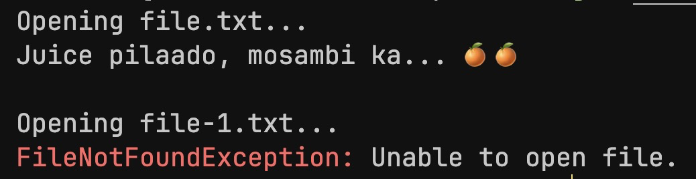

<h1 style="text-align: center;">Exception Handling</h1>

- Exceptions are "problems" that occur during the execution of a program which can be handled by the program to prevent it from crashing.
- Dereferencing a null pointer, accessing forbidden memory, opening a non-existent file, can all cause exceptions.

<br>

<h5>Example 1:</h5>

```C++
int divide (int a, int b)
{
    return (a / b)
}
```
<br>

If `b = 0` then


<br>

Problems like this can be resolved by either <strong>throwing</strong> an exception, and/or <strong>catching / handling</strong> them..

```C++
#include <iostream>
#include <string>

int divide (int a, int b)
{
    if (b == 0)
    {
        std::string eString = "Division By Zero Exception";
        throw eString;
    }

    return (a / b);
}

int main()
{
    try
    {
        std::cout << divide(10, 0) << std::endl;
    }
    catch(std::string e)
    {
        std::cerr << e << std::endl;
    }
    
    return 0;
}
```
<h5>Output:</h5>


<br>

<h5>Example 2:</h5>

```C++
#include <iostream>
int main() 
{
    int *ptr = NULL;
    std::cout << *ptr << std::endl; // throws a segmentation fault

    // can be simply handled by checking ptr for null

    return 0;
}
```
<br>

Sometimes, its helpful to throw multiple types of exceptions (ints, strings), remember to match the catch block to the thrown exception, including its type.

```C++
...
try
{
    // code
}
catch (std::string e1)
{
    // exception 1
}
catch (int e2)
{
    // exception 2
}
```
<br>

These are simple methods to handle exceptions, but these types of error-handling methods can fail to effectively cater to larger and more robust programs, where error-handling needs to be <strong>structured</strong> and more refined.

---

<h3 style="text-align: center;">Exception Classes</h3>

Defining different types of exceptions with classes is an example of structured error handling. 

It is an important tenet in object-oriented programming, especially for code reuse as multiple programs can use the same exception classes.

<br>

<h5>Example:</h5>

```C++
#include <iostream>

class MyException
{
protected:
    std::string message;

public:
    MyException(std::string msg) : message(msg) {}
    std::string what() { return message; }
}

class DivisionByZeroException : public MyException
{
public:
    DivisionByZeroException(std::string msg) 
    { message = "DivisionByZeroException: " + msg; }
};

int divide(int a, int b)
{
    if (b == 0) 
    { throw DivisionByZeroException("undefined behavior!"); }

    return (a / b);
}

int main()
{
    try
    {
        std::cout << divide(10, 0) << std::endl;
    }
    catch (MyException& e)
    {
        std::cerr << e.what() << std::endl; 
        // convention + good practice to use cerr for errors
    }

    return 0;
}
```

<h5>Output:</h5>


<br>

This methodology can be scaled to bigger and more complex systems and programs where encapsulating this logic is important.

For example, a `FileNotFound` exception class can be defined to be thrown when a file is not found, which can then be thrown by a `FileReader` class.

```C++
...
class FileNotFoundException : public MyException
{
public:
    FileNotFoundException(std::string msg) : MyException("\033[91mFileNotFoundException: \033[0m" + msg) {}
};


class FileReader
{
public:
    void readFirstLine(std::string filename)
    {
        try
        {
            std::ifstream file(filename);
            if (!file.is_open())
            {
                throw FileNotFoundException("Unable to open file.");
            }

            std::string line;
            std::getline(file, line);
            std::cout << line << std::endl;
        }
        catch (FileNotFoundException& e)
        {
            std::cerr << e.what() << std::endl;
        }
    }
};


int main()
{

    FileReader reader;

    std::cout << "Opening file.txt..." << std::endl;
    reader.readFirstLine("assets/file.txt");

    std::cout << std::endl;

    std::cout << "Opening file-1.txt..." << std::endl;
    reader.readFirstLine("assets/file-1.txt");

    return 0;
}
```

<h5>Output:</h5>

