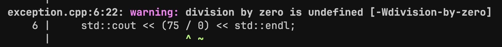

<h1 style="text-align: center;">Exception Handling</h1>

- Exceptions are "problems" that occur during the execution of a program.
- They can be handled by the program to prevent the program from crashing.
- Dereferencing a null pointer, accessing forbidden memory, opening a non-existent file, can all cause exceptions.

<h5>Example 1:</h5>

```C++
int divide (int a, int b)
{
    return (a / b)
}
```
<br>

If `b = 0` then



<br>

Problems like this can be resolved by either <strong>throwing</strong> an exception, and/or <strong>catching / handling</strong> them..

```C++
#include <iostream>
#include <string>

int divide (int a, int b)
{
    if (b == 0)
    {
        std::string eString = "Division By Zero Exception";
        throw eString;
    }

    return (a / b);
}

int main()
{
    try
    {
        std::cout << divide(10, 0) << std::endl;
    }
    catch(std::string e)
    {
        std::cerr << e << std::endl;
    }
    
    return 0;
}
```
<h5>Output:</h5>


<br>

<h5>Example 2:</h5>

```C++
#include <iostream>
int main() 
{
    int *ptr = NULL;
    std::cout << *ptr << std::endl; // throws a segmentation fault

    // can be simply handled by checking ptr for null

    return 0;
}
```
<br>

Sometimes, its helpful to throw multiple types of exceptions (ints, strings), remember to match the catch block to the thrown exception, including its type.

```C++
...
try
{
    // code
}
catch (std::string e1)
{
    // exception 1
}
catch (int e2)
{
    // exception 2
}
```
<br>

These are simple methods to handle exceptions, but these types of error-handling methods can fail to effectively cater to larger and more robust programs, where error-handling needs to be <strong>structured</strong> and more refined.


