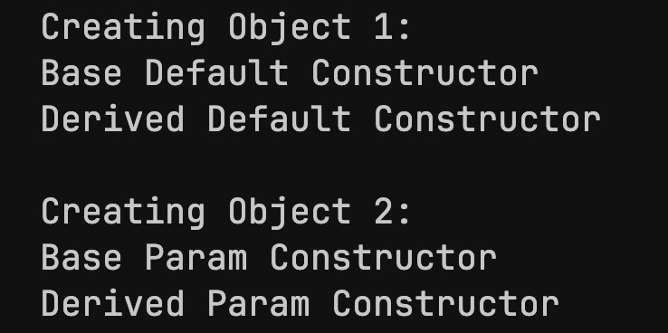

<h1 style="text-align: center;">Inheritance</h1>

- The relationship between parent and child classes is called <strong>inheritance</strong>.
- The parent class is called a <strong>base class</strong> and the child class is called a <strong>derived class</strong>.
<br>
<h3>Types of Relationships</h3>

- Public Relationship
- Protected Relationship
- Private Relationship

---

<h3 style="text-align: center;">Types of Inheritance</h3>

<h4>Single Inheritance</h4>

- A derived class inherits from only one base class.

```C++
class Base {
    // Base class members
};

class Derived : public Base {
    // Derived class members
};
```
<br>
<h4>Multiple Inheritance</h4>

- A derived class inherits from more than one base class.
- This allows the derived class to combine functionality from multiple classes.

```C++
class Base1 {
    // Base1 class members
};

class Base2 {
    // Base2 class members
};

class Derived : public Base1, public Base2 {
    // Derived class members
};  
```
<br>
<h4>Multilevel Inheritance</h4>

- A class is derived from another derived class, creating a chain of inheritance.

```C++
class Base {
    // Base class members
};

class Intermediate : public Base {
    // Intermediate class members
};

class Derived : public Intermediate {
    // Derived class members
};
```
<br>
<h4>Hierarchical Inheritance</h4>

- Multiple derived classes inherit from the same base class. 
- This allows different classes to share a common parent class.

```C++
class Base {
    // Base class members
};

class Derived1 : public Base {
    // Derived1 class members
};

class Derived2 : public Base {
    // Derived2 class members
};
```
<br>
<h4>Hybrid Inheritance</h4>

- A combination of more than one type of inheritance. 
- This can involve any combination of single, multiple, and multilevel inheritance.

```C++
class Base {
    // Base class members
};

class Intermediate1 : public Base {
    // Intermediate1 class members
};

class Intermediate2 : public Base {
    // Intermediate2 class members
};

class Derived : public Intermediate1, public Intermediate2 {
    // Derived class members
};
```
---

<h3 style="text-align: center;">Access Hierarchy</h3>

- <strong>Private</strong>: Members declared as private are only accessible within the class itself. They are not accessible from derived classes or from outside the class.
<br>

- <strong>Protected</strong>: Members declared as protected are accessible within the class itself, in its derived classes, but not from outside the class.
<br>
- <strong>Public</strong>: Members declared as public are accessible from anywhere, including other classes, functions, and derived classes.

<br>

<h4>1. Public Inheritance</h4>

When using public inheritance, the access control is preserved in the derived class:

- Public members of the base class remain <strong>public</strong> in the derived class.
- Protected members of the base class remain <strong>protected</strong> in the derived class.
- Private members of the base class remain private and are <strong>not accessible</strong> directly in the derived class.


<h5>Example</h5>

```C++
class Base {
public:
    int pub;     // Accessible publicly
protected:
    int prot;    // Accessible within Base and Derived
private:
    int priv;    // Only accessible within Base
};

class Derived : public Base {
    // pub is public in Derived
    // prot is protected in Derived
    // priv is inaccessible in Derived
};
```
<br>

<h4>2. Protected Inheritance:</h4>

When using protected inheritance, the access levels are modified:

- Public members of the base class become <strong>protected</strong> in the derived class.
- Protected members of the base class remain <strong>protected</strong> in the derived class.
- Private members of the base class remain private and are <strong>still inaccessible</strong> in the derived class.

<h5>Example</h5>

```C++
class Base {
public:
    int pub;     // Accessible publicly
protected:
    int prot;    // Accessible within Base and Derived
private:
    int priv;    // Only accessible within Base
};

class Derived : protected Base {
    // pub is protected in Derived
    // prot is protected in Derived
    // priv is inaccessible in Derived
};
```
<br>

<h4>3. Private Inheritance:</h4>

When using private inheritance, all inherited members become private in the derived class:

- Public members of the base class become <strong>private</strong> in the derived class.
- Protected members of the base class become <strong>private</strong> in the derived class.
- Private members of the base class remain <strong>private and inaccessible</strong> in the derived class.

<h5>Example</h5>

```C++
class Base {
public:
    int pub;     // Accessible publicly
protected:
    int prot;    // Accessible within Base and Derived
private:
    int priv;    // Only accessible within Base
};

class Derived : private Base {
    // pub is private in Derived
    // prot is private in Derived
    // priv is inaccessible in Derived
}

```
<br>

<h5>Aside: Privately Accessible vs Inaccesible:</h5>

- A non-private member of the the base class becomes <strong>private</strong> through <strong>private inheritance</strong>, and cannot be accessed outside the derived class.
<br>

- A member of the base class becomes <strong>inaccessible</strong> if it is <strong>private</strong> in the base class and is inherited <strong>privately</strong> in the derived class.

<br>

<h4>Summary of Access Hierarchy</h4>

| Base Class Member | Public Inheritance | Protected Inheritance | Private Inheritance |
| ----------------- | ------------------ | --------------------- | ------------------- |
| Public            | Public             | Protected             | Private             |
| Protected         | Protected          | Protected             | Private             |
| Private           | Private       | Inaccessible          | Inaccessible        |

---

<h4>List of methods not inherited by the derived class:</h4>

- Default constructor
- Copy constructor
- Copy assignment operator
- Move assignment operator (=)
- Destructor


<h3 style="text-align: center;">Constructors and Destructors in Inheritance</h3>

- The constructors and destructors are not inherited by the derived class, but we can call the constructor of the base class in derived class.

```C++
#include <iostream>

class Base {
public:
    int pub;     // Accessible publicly
protected:
    int prot;    // Accessible within Base and Derived
private:
    int priv;    // Only accessible within Base

public:
    Base()
    {
        std::cout << "Base Default Constructor" << std::endl;
    }

    Base(int pub, int prot, int priv)
    {
        std::cout << "Base Param Constructor" << std::endl;
        this->pub = pub;
        this->prot = prot;
        this->priv = priv;
    }
};

// calling base constructor in derived class
class Derived : public Base {
private:
    int a;
public:
    
    Derived()
    {
        // base default constructor is called without using constructor initializer list
        std::cout << "Derived Default Constructor" << std::endl;
    }
    Derived(int pub, int prot, int priv, int a) : Base(pub, prot, priv)
    {
        // base param constructor must be called using the above constructor initializer list
        // otherwise only the base default constructor will be called
        std::cout << "Derived Param Constructor" << std::endl;
        this->a = a;
    }
};


// main function
int main()
{
    // creating object of derived class
    std::cout << std::endl << "Creating Object 1:" << std::endl;
    Derived obj1;
    std::cout << std::endl << "Creating Object 2:" << std::endl;
    Derived obj2(1, 2, 3, 10);

    return 0;
}
```

<h5>Output</h5>



- The constructors will be called by the complier in the order in which they are inherited, i.e. base class constructors will be called first, then the derived class constructors.
- The destructors will be called in reverse order in which the compiler is declared.

---
<h3 style="text-align: center;">Friend Functions</h3>

- Friend functions are given special access to the private and protected members of the base class.
- Useful in certain circumstances.

<br>

<h5>Case 1: Using friend paradigm:</h5>

```C++
#include <iostream>
using namespace std;

class Box {
private:
    double width;
public:
    int amount;

public:
    Box(double w) : width(w) {}

    // Friend function declaration
    friend ostream& operator<<(ostream& out, const Box& box);
};

// Friend function definition
ostream& operator<<(ostream& out, const Box& box) {
    out << "Box width: " << box.width;
    return out;
}

int main() {
    Box box(10.5);
    cout << box << endl; // Calls the overloaded << operator
    return 0;
}
```
- All of the members of the base class are accessible to the friend function.

<br>

<h5>Case 2: Without using friend paradigm:</h5>

```C++
#include <iostream>
using namespace std;

class Box {
private:
    double width;

public:
    int amount;

public:
    Box(double w, int a) : width(w), amount(a) {}

    // Member function to print Box data
    void print(ostream& out) const {
        out << "Box width: " << width << std::endl;
    }
};

// Non-member function that calls the member function
ostream& operator<<(ostream& out, const Box& box) {
    box.print(out); // Calls the print member function to access private data
    out << "Number of boxes: " << box.amount;
    return out;
}

int main() {
    Box box(10.5, 5);
    cout << box << endl; // Calls the overloaded << operator
    return 0;
}
```
- Only `amount` is accessible to the friend function, not `private`.

<br>

<h5>Output for both cases:</h5>


---

<h3 style="text-align: center;">Upcasting And Slicing</h3>

- Upcasting is the process of converting a derived class object to a base class object.
- This is done by "casting" a pointer or reference to a derived class to a pointer or reference to its base class.

```C++
...
int main()
{
    Derived d;
    Base* b = &d;

    return 0;
}
```
<br>

- A base class object (not a pointer / reference) is <strong>sliced</strong> when it is converted to a derived class object

```C++
...
int main()
{
    Base b;
    Derived* d = &b;

    return 0;
}
```
- This may lead to loss of data / functionality and is generally less safer than upcasting.