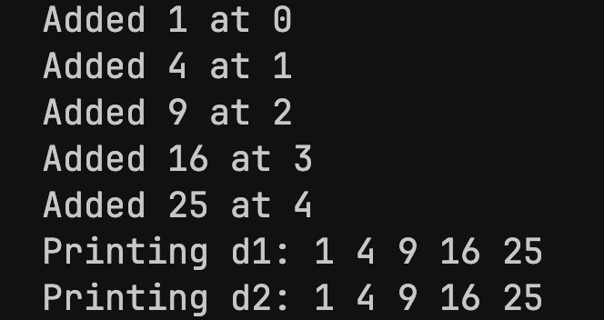
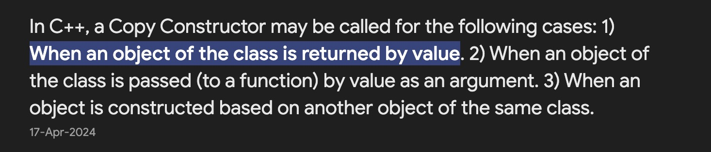

<h1 style="text-align: center;">Objects</h1>

<h3>Constructor</h3>

- A constructor is called when an object is initialised.
- It has the same name as the class.
- It is automatically called by the compiler (built-in / non-parameterised)
- It can be overloaded to change the behaviour of an object.
<br>

<h5>Example</h5>


```C++
#include <iostream>
using namespace std;

class Dummy
{
private:
    int a;
    float f;

public:
    Dummy()
    {
        this->a = 5;
        this->f = 2.5;
        cout << "Constructor called!" << endl;
    }

    // overloading constructor to assign args
    Dummy(int a1, float f1)
    {
        this->a = a1;
        this->f = f1;
        cout << "Constructor called!" << endl;
    }

    void printAll()
    {
        cout << this->a << " " << this->f << endl;
    }
};

int main()
{
    Dummy d;

    // constructor overloading
    Dummy d2(10, 20.5);

    d.printAll();

    return 0;
}
```
<br>

We can also define <strong>one constructor</strong> to fit multiple overloading cases:

```C++
...
public:

// setting default values when args are not present
Dummy (int n1 = 5, float n1 = 2.5)
{
    this->a = n1;
    this->f = n2;
    cout << "Constructor called!" << endl;
}
```
<br>

- If for some reason, we want to call the <strong>original</strong> constructor after overloading it, we can do so by:

```C++
...
Dummy d();
```

---

<h3>Array of objects</h3>

Like other data-types, we can create an array of objects with the same class:

```C++
// static initialization
Dummy array[10];

// dynamic initialization
Dummy* array = new Dummy[10];
```
---

<h3>Destructor</h3>

- A destructor is called when an object is destroyed.
- It has the same name as the class, preceded by a tilde (~).
- It is automatically called by the compiler (built-in / non-parameterised)
- It also can be overloaded.
- It destroys objects in <strong>reverse order</strong> of their creation.
<br>

<h5>Example</h5>

```C++
...
~Dummy()
{
    cout << "Destructor called!" << endl;
    // add destruction functionality
}
```
- Once overloaded, you <strong>cannot</strong> redeclare the destructor.

---

<h3>Using :: operator</h3>

- We can use the :: operator to access members of the class from outside the class.

```C++
...
class Dummy
{
private:
    int a;
    float f;

public:
    Dummy();

    void printAll();

    void printAll(Dummy d);
};


// accessing members of the class
void Dummy::Dummy()
{
    this->a = 5;
    this->f = 2.5;
    cout << "Constructor called!" << endl;
}

void Dummy::printAll()
{
    cout << this->a << " " << this->f << endl;
}

void Dummy::printAll(Dummy d)
{
    cout << d.a << " " << d.f << endl;
}
``` 

---
<h3>Copy Constructor</h3>

- A copy constructor is called when an object is copied from another object.
- It copies properties of an object, including pointers to a new object.
- If for example, a property was a pointer to an array, the new object would also point to the <strong>same</strong> array in memory. This is called a <strong>shallow copy</strong>.
- Implementing a <strong>deep copy</strong> can help in dynamically allocating a seperate block with copied data.

```C++
#include <iostream>
#include <cmath>
using namespace std;

class DynamicArray
{
    int* data;
    int size;

public:
    DynamicArray(int size)
    {
        this->data = new int[size];
        this->size = size;
    }

    // copy constructor
    DynamicArray(DynamicArray& d)
    {
        delete[] this->data;

        this->data = new int[d.size];
        this->size = d.size;
        for (int i = 0; i < d.size; i++)
        {
            this->data[i] = d.data[i];
        }
    }

    // overloaded destructor
    ~DynamicArray()
    {
        delete[] this->data;
    }

    // print method
    void print()
    {
        for (int i = 0; i < this->size; i++)
        {
            cout << this->data[i] << " ";
        }
        cout << endl;
    }

    // add at index method
    void addAt(int index, int value)
    {
        this->data[index] = value;
        printf("Added %d at %d\n", value, index);
    }
};

int main()
{
    DynamicArray d1(5);

    d1.addAt(0, 1);
    d1.addAt(1, 4);
    d1.addAt(2, 9);
    d1.addAt(3, 16);
    d1.addAt(4, 25);

    printf("Printing d1: ");
    d1.print();

    // copy to d2
    DynamicArray d2(d1);

    printf("Printing d2: ");
    d2.print();

    return 0;
}
```
<br>
<h5>Output:</h5>



<br>
<h4>Aside: Call by Value v/s Call by Reference and Copy Constructor</h4>

- If the object itself is passed as argument, a copy of the object is created in a seperate memory block, and is passed to the function.
- Here, the object to be copied <strong>must always</strong> be passed by reference, as copying by value will result in an "infinite loop".




---
<h3>Assignment Operator (=)</h3>

- The assignment operator is called when an object is assigned to another object.
- It can be overloaded by the user if the default assignment operator is not sufficient (e.g. it only shallow copies data).

```C++
class Dummy
{
...
    // overloading assignment operator
    void operator=(const Dummy &other)
    {
        delete[] array;
        
        for (int i = 0; i < ARRAY_SIZE; i++)
            array[i] = other.array[i];
    }

};

int main()
{
    Dummy d1;
    Dummy d2;

    d2 = d1;

    return 0;
}
```
- The assignment operator can also act on multiple objects simultaneously.
- It is executed from <strong>right-to-left</strong>.
<br>

<h4>Assignment Operator v/s Copy Constructor</h4>

- Although they are functionally similar, the <strong>assignment operator</strong> is used to copy data from one object to another, and the <strong>copy constructor</strong> is used to create a new object (allocating memory for it) from an existing object.
---
<h3>General Operator Overloading</h3>

- A lot of operators can be overloaded to suit user needs.
- For example, we can overload the <strong>+</strong> operator to add two objects of the same class, or just mutauting properties of objects.

```C++
... 
Dummy operator+(const Dummy &d2)
{
    Dummy temp;

    temp.a = this->a + d2.a;
    temp.f = this->f + d2.f;

    return temp;
}
```
<br>

<h4>Overloading relational operators:</h4>

- Relational operators are used to compare two objects of the same class.
- Examples: <, >, ==, !=, <=, >=, etc.

<br>

<h5> Example ">" overloading (class activity)</h5>

```C++
...
// Dummy:-> int feet; int inches;
bool operator>(const Dummy &d2)
{
    return ((this->feet > d2.feet) || (this->feet == d2.feet && this->inches > d2.inches)) ? 1 : 0;
}
```

<h5>Example "==" overloading (class activity)</h5>

```C++
...
bool operator==(const Dummy &d2)
{
    return ((this->feet == d2.feet) && (this->inches == d2.inches)) ? 1 : 0;
}
```
<h5>Example "!=" overloading (class activity)</h5>

```C++
...
bool operator!=(const Dummy &d2)
{
    return (*this == d2) ? 0 : 1;
}
```

<br>
<h4>Overloading incremental operators</h4>

- Incremental operators are used to increment or decrement the properties of an object.
- Examples: ++, --, +=, -=, etc.

<br>
<h5>Example pre-increment "++" overloading (class activity)</h5>

```C++
...
// Dummy:-> int feet; int inches;

// pre-increment overload
Dummy operator++()
{
    this->inches++;

    // adjust feet and inches accordingly
    simplify();

    return *this;
}
```

<h5>Example post-increment "++" overloading (class activity)</h5>

```C++
...
// post-increment overload
Dummy operator++(int)
{
    Dummy temp = *this;

    this->inches++;
    simplify();

    // return unincremented object
    return temp;
}
```
---
<h2 text-align="center;">Object Relationships</h2>

- Relationships define how objects interact and relate with each other.

<h3>1. Association</h3>

- Two objects are related with a "uses-a" relationship.


```C++
class Teacher 
{
public:
    void teach(Student &student) 
    {
        // Teacher interacts with Student
    }
};
```
<br>

<h3> 2. Aggregation</h3>

- An object is related with another object with a "has-a" relationship.
- It is a special type of association, where the contained object can exist outside the container (weak ownership).

```C++
class Book 
{
public:
    std::string title;
    Book(std::string title) : title(title) {}
};

class Library 
{
public:
    std::vector<Book*> books;  // Aggregated relationship with Book

    void addBook(Book* book) 
    {
        books.push_back(book);
    }
};
```

- If the containing (aggregate) object is destroyed, the contained (aggregated) object is not necessarily destroyed as well.

<br>

<h3>3. Composition</h3>

- A stronger relationship where one class contains another class, and the contained objects have a <strong>dependent</strong> lifecycle.
- This is also a "has-a" relationship, but with <strong>strong</strong> ownership.

```C++
class Room 
{
public:
    std::string name;
    Room(std::string name) : name(name) {}
};

class House 
{
private:
    std::vector<Room> rooms;  // Composed relationship with Room

public:
    void addRoom(const std::string& roomName) {
        rooms.emplace_back(roomName);
    }
};
```

- `House` and `Room` are in a composition relatioship - one cannot exist without the other.
- The contained objects are destroyed when the containing object is destroyed.

