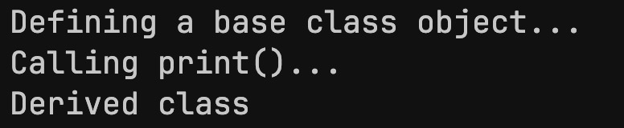
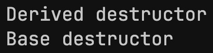
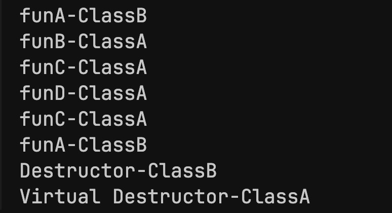
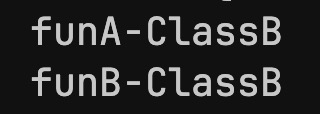

<h1 style="text-align:center;">Polymorphism</h1>

- Polymorphism is the ability of an object to exhibit different characteristics based on certain circumstances.

<h3>Types of Polymorphism</h3>

- Compile-time polymorphism
- Runtime polymorphism

---
<h3 style="text-align: center;">Compile-time Polymorphism</h3>

- Compile-time polymorphism is resilved at compile-time typically through function overloading and operator overloading.

- The compiler decides which function / operator to call based on the context in which it is used.
---
<h3 style="text-align:center;">Run-time Polymorphism</h3>

- Run-time polymorphism is the ability of an object to exhibit different characteristics based on the context in which it is used.

<br>

Run-time polymorphism is implemented using:

- Inheritance
- Function overriding
- Virtual functions
- Base class pointer / reference.

<br>

<h4>Virtual Functions</h4>

- A function defined in the base class which can be overriden in the derived classes.


<h5>Example</h5>

```C++
#include <iostream>

class Base {
public:
    virtual void print() {
        std::cout << "Base class" << std::endl;
    }
};

class Derived : public Base {
public:
    void print() override {
        std::cout << "Derived class" << std::endl;
    }
};

int main() {
    std::cout << "Defining a base class object..." << std::endl;
    Base *b = new Derived();

    std::cout << "Calling print()..." << std::endl;
    b->print();

    return 0;
}
```

<h5>Output</h5>



<br>

- At run-time, a base class pointer may store the reference to a derived class object. 

- Declaring the base class method as virtual allows the derived class to override it; the derived class method is now called through the base class pointer.

<br>

<h4>Virtual Functions Under the Hood (Vtables)</h4>

- The compiler constructs a virtual table for every class containing virtual functions.
- The virtual table contains the addresses of all the virtual functions in the class.
- Vtables store the derived class implementations of the virtual functions, otherwise they store the base class implementations.

<br>

<h4>Abstract Classes</h4>

- Any class which contains at least one <strong>pure virtual function</strong> is an abstract class. 
- Pure virtual functions in an abstract class are declared as `virtual`, have no implementation, and have `= 0` at the end of its signature.
- Derived classes need to override the pure virtual functions to not exhibit abstract class behavior.
- Abstract classes are used to define a common "interface" for its derived classes.


<h5>Example</h5>

```C++
class Base {
public:
    virtual void print() = 0;
};


class Derived : public Base {
public:
    void print() override {
        std::cout << "Derived class" << std::endl;
    }
};

int main() {
    std::cout << "Defining a base class object..." << std::endl;
    Base *b = new Derived();

    std::cout << "Calling print()..." << std::endl;
    b->print();

    return 0;
}
```

<h5>Output</h5>


---
<h3>Virtual Destructors</h3>

- When an object is deleted through its base class pointer, the destructor being called will depend on whether the base class destructor is virtual or not.

- If the base class destructor is virtual, the derived destructor will be called with the base class destructor, otherwise, <strong>only</strong> the base class destructor will be called.

<h5>Example 1: Without Virtual Destructor</h5>

```C++
class Base 
{
public:
    ~Base() { std::cout << "Base destructor\n"; }
};

class Derived : public Base 
{
public:
    ~Derived() { std::cout << "Derived destructor\n"; }
};

int main() 
{
    Base* ptr = new Derived();
    delete ptr;  // Undefined behavior! Only Base destructor is called
}

```


<br>

<h5>Example 2: With Virtual Destructor</h5>

```C++
class Base 
{
public:
    virtual ~Base() { std::cout << "Base destructor\n"; }
};

class Derived : public Base 
{
public:
    ~Derived() { std::cout << "Derived destructor\n"; }
};

int main() 
{
    Base* ptr = new Derived();
    delete ptr;  // Derived destructor is called
}
```


Declaring virtual destructors, therefore, are useful when the program requires upcasting (accessing a derived class object through its base cass pointer). Since the pointer only has access to base class methods and therefore will **only** call the base class destructor upon deletion, **virtual destructors** defined in the base class are useful to completely destroy the object.

Declaring the base destructor as virtual ensures all derived destructors are implicitly virtual. Without virtual propagation, the compiler might not invoke destructors further down the hierarchy. You don't need to explicitly declare every derived-class destructor as virtual; it happens automatically when the base destructor is virtual.

---

<h3>Quiz 3 example:</h3>

```C++
#include <iostream>

using namespace std;

class A
{
public:
    virtual void funA()
    {
        cout << "funA-ClassA" << endl;
    }

    void funB()
    {
        cout << "funB-ClassA" << endl;
    }

    void funC()
    {
        cout << "funC-ClassA" << endl;
    }

    void funD()
    {
        cout << "funD-ClassA" << endl;
        funC();
        funA();
    }

    virtual ~A()
    {
        cout << "Virtual Destructor-ClassA" << endl;
    }

};

class B : public A
{
public:
    void funA()
    {
        cout << "funA-ClassB" << endl;
    }

    void funB()
    {
        cout << "funB-ClassB" << endl;
    }

    ~B()
    {
        cout << "Destructor-ClassB" << endl;
    }
};

int main()
{
    A *a = new B();
    a->funA();
    a->funB();
    a->funC();
    a->funD();
    delete a;

    return 0;
}
```

<h5>Output</h5>



<h5>Explanation</h5>

- The object of type `B` is accessed by its base class pointer: `A *a = new B()`.
- The compiler does not know the type of the object at compile-time, hence it resolves subsequent function calls at runtime.
- `a->funA()` is resolved to `B::funA()` (B's implementation), overriding the original virtual function.
- `a->funB()` is resolved to `A::funB()` (A's implementation), as the object is being called through its base class pointer. Same story for `funC()` and `funD()`.
<br>

- <strong>Note:</strong> 
If the object was instead defined as: `B *a = new B()`, then `a->funB()` would be resolved to `B::funB()` (B's implementation), since its now just a pointer to an object of type `B`.

<h5>Example output:</h5>



<br>