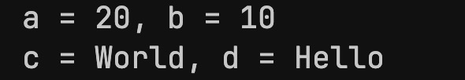
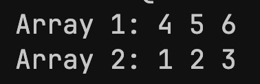
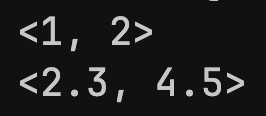
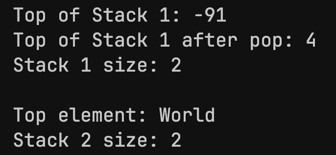

<h1 style="text-align: center;">Templates</h1>

- C++ provides templates as another avenue for implementing compile-time polymorphism.
- The compiler writes code for us, based on the code written.
- The compiler deduces the types on compile-time and writes the code accordingly.

```C++
#include <string>
#include <iostream>

template <typename T>

void swapValues(T &x, T &y)
{
    T temp = x;
    x = y;
    y = temp;
}

int main()
{
    int a = 10, b = 20;
    std::string c = "Hello", d = "World";

    swapValues<int>(a, b); // swap(a, b) can also be used, compiler infers types automatically.

    swapValues<std::string>(c, d);

    std::cout << "a = " << a << ", b = " << b << std::endl;
    std::cout << "c = " << c << ", d = " << d << std::endl;

    return 0;
}
```
<h5>Output:</h5>




<br>

<h3>Template Specialization</h3>

- Template specialization allows definition of an implementation for a specific type, while still allowing the general template to work with other types.

```C++
#include <string>
#include <iostream>

template <typename T>
void swapValues(T &a, T &b)
{
    T temp = a;
    a = b;
    b = temp;
}

// new function
template <typename T, int N>
void swapValues(T (&arr1)[N], T (&arr2)[N])
{
    for (int i = 0; i < N; i++)
        swapValues(arr1[i], arr2[i]);
}

int main()
{
    int arr1[3] = {1, 2, 3};
    int arr2[3] = {4, 5, 6};

    swapValues(arr1, arr2);

    std::cout << "Array 1: ";
    for (int i = 0; i < 3; i++)
    {
        std::cout << arr1[i] << " ";
    }
    std::cout << std::endl;

    std::cout << "Array 2: ";
    for (int i = 0; i < 3; i++)
    {
        std::cout << arr2[i] << " ";
    }
    std::cout << std::endl;

    return 0;
}
```
<br>

<h5>Output:</h5>


<br>

<h4>Aside: Passing some run-time calculations to compile-time expressions</h4>

- We can use `constexpr` before specific calculations / variables to calculate at compile-time.

```C++
// example function
constexpr int add(int a, int b) 
{
    return a + b;
}
```
- Can use it an a constant expression like this:

```C++
int arr[add(2, 3)]; // arr is an array of size 5
```

<br>

<h3>Working with different types</h3>

- You can also use templates to work with different types.

```C++
// RUNS ON DOCKER
#include <string>
#include <iostream>

template <typename T, typename U>
// auto deduces the return type at compile-time
auto max(T a, U b)
{
    return (a > b) ? a : (b > a) ? b : 0;
}

int main()
{
    int a = 4, b = 15;
    
    std::cout << max(a, b) << std::endl;

    return 0;
}
```
<br>

<h4>Example: Templates with Structures</h4>

```C++
template <int N>
struct Factorial
{
    static constexpr int value = N * Factorial<N - 1>::value;
};
template <>
struct Factorial<0>
{
    static constexpr int value = 1;
};

int main()
{
    std::cout << Factorial<5>::value << std::endl;
    return 0;
}
```
<br>

---

<h3>Template Classes</h3>

- Template functionality can be extended to classes as well.
- This is useful for defining "container" classes (containing instances of other classes).


<h5>Example:</h5>

```C++
#include <iostream>

template <typename T>
class Vector
{
public:
    T x, y;
    Vector(T x, T y) : x(x), y(y) {}
    void printVector() {std::cout << "<" << x << ", " << y << ">" << std::endl;}
};

int main()
{
    Vector<int> v1(1, 2);
    Vector<double> v2(2.3, 4.5);

    v1.printVector();
    v2.printVector();

    return 0;
}
```

<h5>Output:</h5>



<br>

<h4>Template Stack Class Example</h4>

```C++
#include <iostream>
using namespace std;

template <typename T>
class Stack {
private:
    T* arr;        // Pointer to dynamically allocated array
    int top;       // Index of the top element
    int capacity;  // Maximum capacity of the stack

public:
    // Constructor
    Stack(int size) {
        arr = new T[size];
        capacity = size;
        top = -1;
    }

    // Destructor
    ~Stack() {
        delete[] arr;
    }

    // Push an element onto the stack
    void push(T value) {
        if (isFull()) {
            cout << "Stack Overflow! Cannot push " << value << endl;
            return;
        }
        arr[++top] = value;
    }

    // Pop an element from the stack
    void pop() {
        if (isEmpty()) {
            cout << "Stack Underflow! Nothing to pop." << endl;
            return;
        }
        --top;
    }

    // Peek the top element of the stack
    T peek() const {
        if (isEmpty()) {
            throw runtime_error("Stack is empty! Cannot peek.");
        }
        return arr[top];
    }

    // Check if the stack is empty
    bool isEmpty() const {
        return top == -1;
    }

    // Check if the stack is full
    bool isFull() const {
        return top == capacity - 1;
    }

    // Get the current size of the stack
    int size() const {
        return top + 1;
    }
};

int main() {

    Stack<int> s1(5);

    s1.push(345);
    s1.push(4);
    s1.push(-91);

    cout << "Top of Stack 1: " << s1.peek() << endl;

    s1.pop();

    cout << "Top of Stack 1 after pop: " << s1.peek() << endl;
    cout << "Stack 1 size: " << s1.size() << endl;


    Stack<string> s2(3);

    s2.push("Hello");
    s2.push("World");

    cout << "Top element: " << s2.peek() << endl;
    cout << "Stack size: " << s2.size() << endl;

    return 0;
}

```

<h5>Output:</h5>

